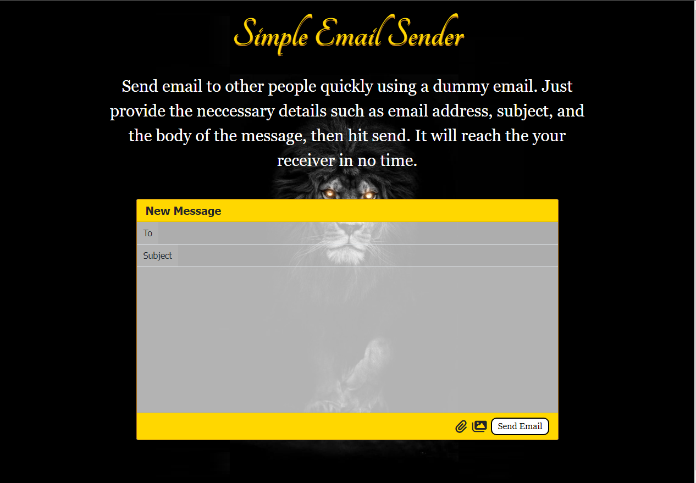

# Simple Email Sender
](https://github.com/Lorddickenstein/EmailSender)
Modern way of sending email with Python 3.x.
](https://github.com/Lorddickenstein/EmailSender)

## Instructions
- Before running the program:
	- Set up your 2-Step Verification on the email that you will be using. The path is
	`Manage your google accout>Security>Signin in to Google`
	- Go to `App passwords`, input your gmail passwords to confirm yourself, then `Select app>Mail`, select `other (custom name)` for the device and put 'python' or any other name
	- Click `GENERATE` and make sure that you copy the generated code
	- Add the code to your environmental variables or even better, use venv by python

## Installations and Setups

### Python Script (simple_email_sender.py)
If you only want the Simple Email Sender, just download `simple_email_sender.py` and run the program. No need to install anything as everything is already in the default python packages.

### Web App (Flask)
If you want to test the web app, you can clone this repository and run it on your local web server. You can use virtual environment to run this project if you wish. Follow this instruction:
- Go to the project's directory in your terminal or cmd line
- Run `pip3 -m install -r requirements.txt` to install all dependencies
- Run `python3 app.py`. This will start a local server on your computer
- Copy the url which is basically the same for everyone, `http://127.0.0.1:5000` or `localhost:5000`
- If you want to use other ports, run the program by adding another argument for the port number. Example: `python3 app.py 5050`
	- Note: You can only choose between 1024 to 65535
- Open your web browser, preferably Chrome, and paste the url to the address bar. Hit enter, and it will take you to the home-page

## Usage
This project is pretty straightforward. You just have to provide the necessary inputs such as the email address which will be receiving the email, the subject of your email, and your message. You can test this using a temporary [email receiver](temp-mail.org). 

This program uses a dummy gmail account which exists for the sole purpose of testing.

## Acknowledgment
Special thanks to [Tomi Tokko](https://github.com/tomitokko) for showing the modern way of sending an email.

Go to his channel on [YouTube](https://www.youtube.com/c/CodeWithTomi).